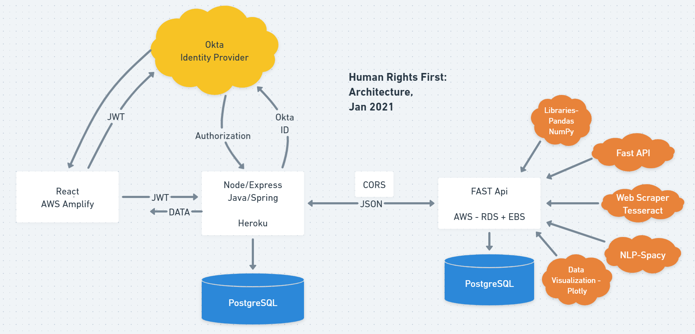
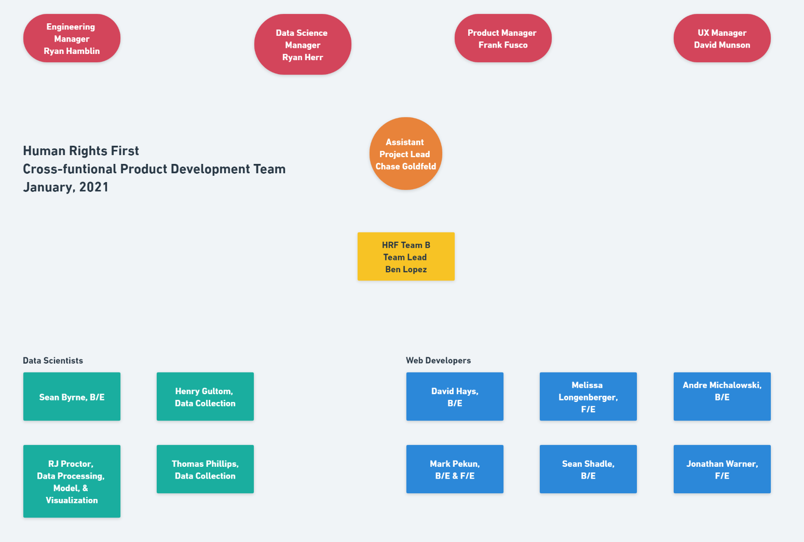

# Human Rights First - Asylum
An application to assist immigration attorneys and refugee representatives in advocating for cilents in asylum cases by identifying patterns in judicial decisions and predicting possible outcomes based on those patterns

## Description
We participated in the building of an application for human rights first, a 501(c)3 organization. Our application uses optical character recognition to scan input court decisions for such values as the name of the presiding judge, the decision, and the asylum seeker's country of origin, and inserts these values into a database. The hope is that advocates for asylum seekers can use these data to better tailor their arguments before a particular judge and maximize their client's chances of receiving asylum. To use the application offline, follow the steps under Installation.

## Architecture


## Process
*  The stakeholder provided documents that became the foundation of our database schema.  We built database, scraped pdf documents from the internet, and filtered from them asylum cases only to populate the corpus of documents in our database.

*  Each pdf document was read using optical character recognition (OCR), converted to text to plain text and then to json which allowed us to search through each document and retrieve keywords.  These keywords will become fields in tables in our relational database.

*  We created an API connecting the database to the web development back-end with the result that user uploaded case files can be inserted into the database.

*  We created a model that, once the database has persiting data and the model is adjusted to the specificity of that data, will predict a posible outcome of an individual judge's or panels of judges decision(s) based on his/her/their past rulings of similar cases.  This model will also render results that display easy to interpret and use (from UX perspective) visualizations on micro-patterns within the data

## Time structures
Each team worked in weekly sprints with a total time contraint of one month for the total project.  Teams met with stakholder(s) during each sprint to present progress, ask questions, recieve feedback and explore evolving stakholder expectations.  The structure of each sprint was set:
  *  Week 1 - Planning
  *  Weeks 2 - 3 Working the Plan (coding and revising the plan according to evolving stakeholder needs and new understandings of the business problem)
  *  Week 4 - Documentation and Presenting Work

Labs 29 chose to work together on all tasks and accomplished:
  *  create an empty database with no schema
  *  create a PDF scraper using OCR that converted PDF images to text
  *  create a pathway to completion of FASTAPI

Labs 30 chose to work asynchronously, yet supporting one another through pair-coding sessions and peer reviews and acomplished:
  *  creating a relational database with [schema](assets/HRF_DS_DB_schema_diagram_SeanB.png)
  *  completed connections between FASTAPI and the back-end of the web application
  *  adapting Team 1's PDF scraper to filter out only asylum cases and then convert PDF images to text and then to json
  * create a PDF scraper for search terms in all categories except social groups (time constraints)
  *  explore alternative scraping methods for PDFs and keywords in search of effieciencies
  *  create a pathway for data processing, model and visualization completion once there is persitent data

## Tools

 * [Pytesseract](https://github.com/madmaze/pytesseract)
 * [FastAPI](https://github.com/tiangolo/fastapi)
 * [AWS Elastic Beanstalk](https://aws.amazon.com/elasticbeanstalk/)

## Installation

 After cloning the repository, in your command line run the following commands:
 ```
pipenv install --dev
pipenv shell
docker build -t ds-asylum-app .
docker run -p 8000:8000 ds-asylum-app
 ```
 Then open localhost:8000 in your browser. The application should be running. 

 ## Contributors

 [Tristan Brown, Labs29](https://github.com/Tristan-Brown1096)

 [Sean Byrne, Labs30](https://github.com/ssbyrne89)

 [Henry Gultom, Labs30](https://github.com/henryspg)
 
 [Liam Cloud Hogan, Labs29](https://github.com/liam-cloud-hogan)
 
 [Steven Lee, Labs29](https://github.com/StevenBryceLee)

 [Edwina Palmer, Labs29](https://github.com/edwinapalmer)

 [Tomas Phillips, Labs30](https://github.com/tomashphill)

 [RJ Proctor, Labs30](https://github.com/jproctor-rebecca)



 ## License

 This project is licensed under the terms of the MIT license.
